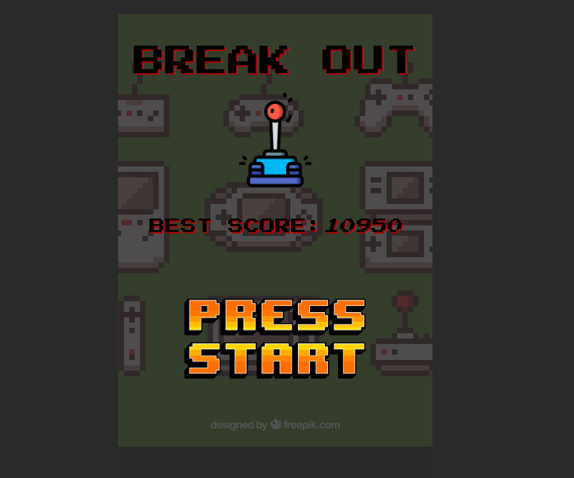

<h1>BREAK OUT GAME</h1>
LINK PLAY--> https://oldi92.github.io/break-out-game/
 
 

Description:  
<strong>Object Oriented</strong> retro classic break out game created with canvas, vanilla javacript!

<h2>LEVEL 1 new features:</h2>   
Levels: 
1-1, 1-2, 1-3, 1-4, 1-5 

<h2>LEVEL 2 new features:</h2>   
i)Bricks need 2 hit to break 
Levels: 
2-1, 2-2, 2-3, 2-4, 2-5 

<h2>LEVEL 3 new features:</h2>   
i)When bricks break you unlock random mystery box to manipulate the player 
Levels: 
3-1, 3-2, 3-3, 3-4, 3-5 
